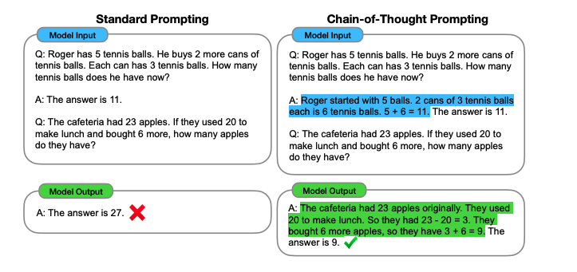
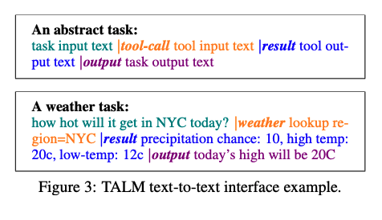
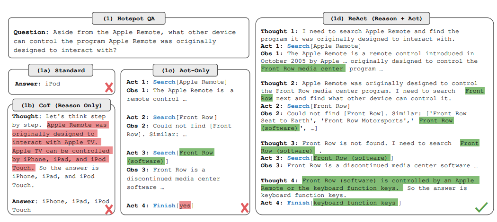
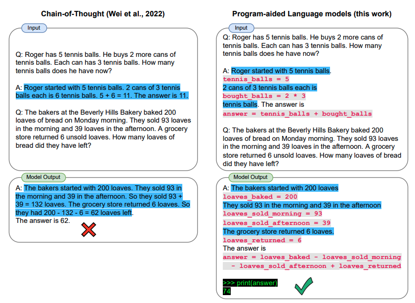
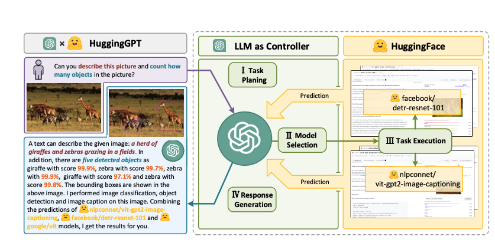
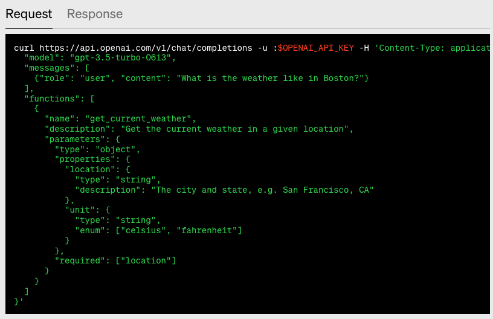
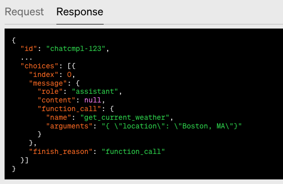
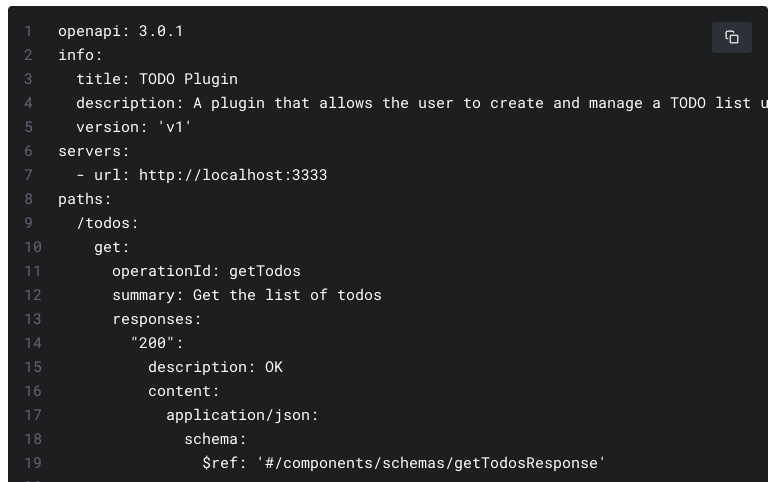

<!-- _class: lead invert -->
# Extending LLMs with Tools
---

# Example of Tools

* Google/Bing Search
* Wikipedia
* WolframAlpha
* Internal Knowledge Base
* Internal APIs

---
# Langchain Example

```
from langchain.agents import load_tools
from langchain.agents import initialize_agent
from langchain.agents import AgentType
from langchain.llms import OpenAI

llm = OpenAI(temperature=0)
tools = load_tools(["serpapi", "llm-math"], llm=llm)
agent = initialize_agent(tools, llm, agent=AgentType
ZERO_SHOT_REACT_DESCRIPTION, verbose=True)
agent.run("Who is Leo DiCaprio's girlfriend? What is her current age raised to the 0.43 power?")
```

---
# Overview

* High-level review of related papers
* OpenAI Tools
* LangChain Tools Demo


---
# Chain-of-Thought
<!---
- evaluated Palm, GPT3, and LAMDA, and UL20
- chain of thought positively impacts large models (100B) and not small ones
- performance gains on more complex problems than simple ones
- tested whether chaint of thought did anything by giving it after the answer and it seemed to do so. not just learned from pretrained data.
- paper had a lot of examples with whether model was really doing anything and their experiments proved it was by giving it examples that weren't in the chain of thought
--->
* [Chain-of-Thought Prompting Elicits Reasoning in Large Language Models](https://arxiv.org/pdf/2201.11903) (Jan 2022)

<p align="center">
    
</p>

---
# Zero-shot Reasoning
<!---
- included palm and gpt (text-davinci-2) and other open source models. 17 in total
- performance deteriorates if prompt examples and question type do not match
- two stage prompting: think step by step then add reasoning to second prompt to get the answer
- other prompts:
  -  Let’s think step by step.
  -  Let’s think about this logically
  -  Let’s think like a detective step by step
  -  Don’t think. Just feel.
- few shot better still overall but requires human intervention
--->
* [Large Language Models are Zero-Shot Reasoners](https://arxiv.org/pdf/2205.11916.pdf) (May 2022)

<p align="center">
    
</p>

---
# LLMs with Tools

<!---
- loop of getting tool input from text, invoking tool API, and generate final output
- iterative self play
- tested on knowledge Q&A and Math

--->
* [TALM: Tool Augmented Language Models](https://arxiv.org/pdf/2205.12255.pdf) (May 2022)

<p align="center">
    
</p>

---
# ReAct
<!---
- However, when finetuned with just 3,000 examples, ReAct becomes the best
method among the four, with PaLM-8B finetuned ReAct outperforming all PaLM-62B prompting
methods, and PaLM-62B finetuned ReAct outperforming all 540B prompting methods.

--->
* [ReAct: Synergizing Reasoning and Acting in Language Models](https://arxiv.org/pdf/2210.03629.pdf) (October 2022)

<p align="center">
    
</p>

---
# LLMs Running Code
<!---
- PAL generates code for a Python interpreter,

--->
* [PAL: Program-aided Language Models](https://arxiv.org/pdf/2211.10435.pdf) (Nov 2022)

<p align="center">
    
</p>

---
# HuggingGPT
<!---
- orchestrate models to solve complex tasks
- LLM plans tasks, assigns them to models, collects results, and responds to user
- More specifically, for each AI model in Hugging
Face, we use its corresponding model description from the library and fuse it into the prompt to
establish the connection with ChatGPT
- we expect that the LLM can parse tasks by following some specifications (e.g., JSON format)
- However, due to the constraints regarding maximum
context length, it is impossible for a prompt to include all relevant model information. To address this
issue, we first filter out models based on their task type and only retain those that match the current
task type. For these selected models, we will rank them based on the number of their downloads on
Hugging Face (we think the downloads can reflect the quality of the model to some extents) and then
select the top-K models as the candidate models for HuggingGPT. This strategy can substantially
reduce the token usage in the prompt and effectively select the appropriate models for each task
- We
use GPT-4 to generate task planning as the pseudo
labels, which cover single, sequential, and graph
tasks.
--->
* [HuggingGPT: Solving AI Tasks with ChatGPT...](https://arxiv.org/pdf/2303.17580.pdf) (March 2023)

<p align="center">
    
</p>

---
# OpenAI Function Calling

* Similar to LangChain tools but built into the model API

<p align="center">
    
    
</p>

---
# OpenAI Plugins

* Calls REST APIs based on API specs

<p align="center">
    
</p>

---
# LangChain Tools Demo

* Supports using tools with arbitrary functions
* Mileage will vary based on the model, tools, and task

---
# Conclusion

* LLMs alone are impressive
* LLMs augmented with tools are superior
* Wild speculation
    * Smaller LLMs that can orchestrate tools will be embedded on device or in browser
